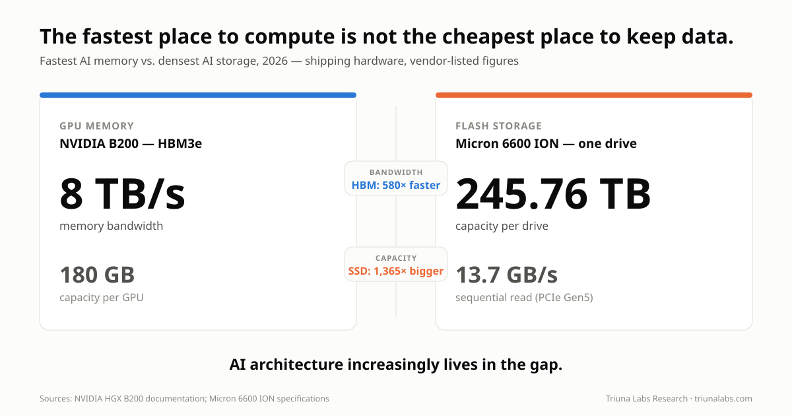
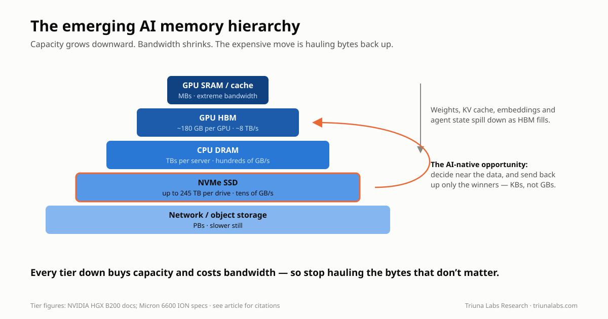
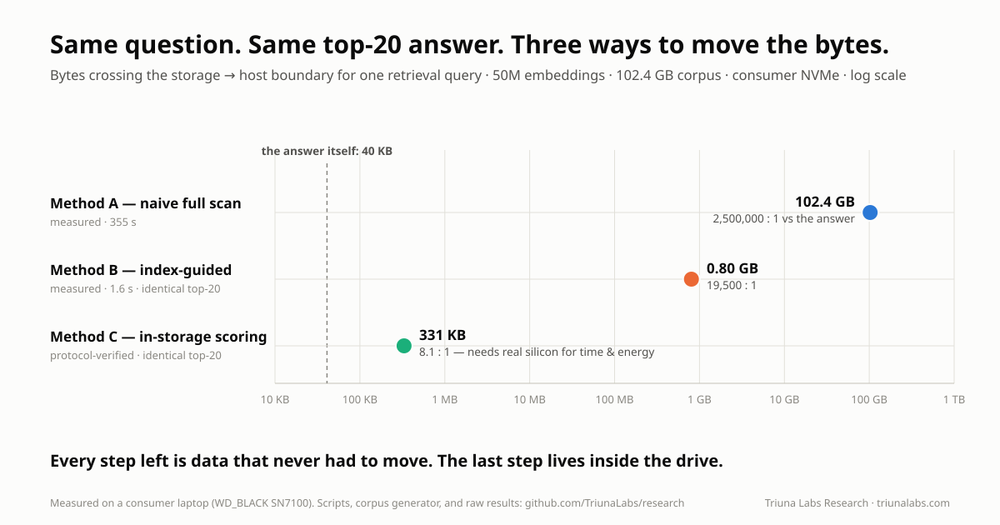
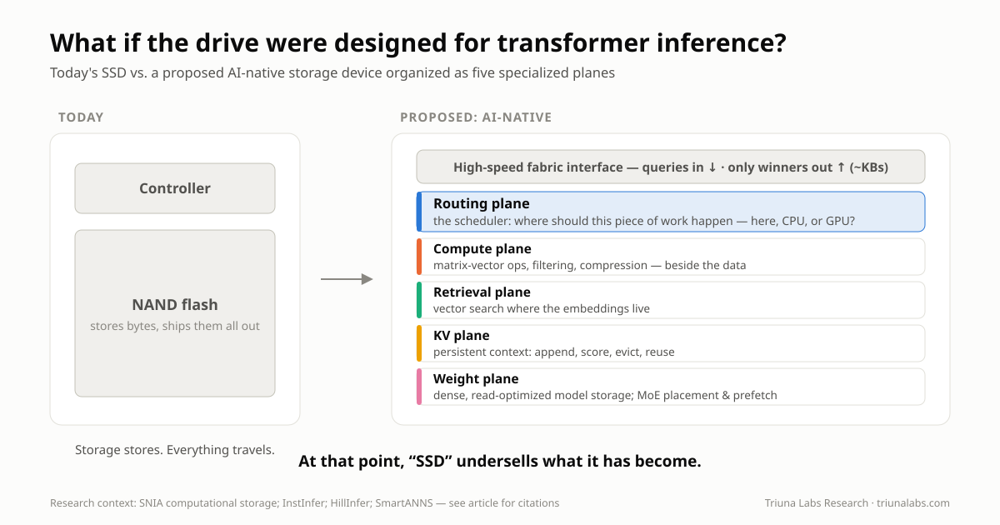

# 🧠 Route the Work, Not Just the Data: GPUs, CPUs, and the Rise of AI-Native Storage

*By Paul Woll · Triuna Labs Research · August 18, 2026*

When we think about Large Language Models, we tend to picture GPUs.

That makes sense. Modern generative AI would not exist at its current scale without them.

But GPUs also expose one of AI's increasingly important architectural problems:

> **The fastest place to compute is not the cheapest place to keep data.**

An NVIDIA B200 GPU has 180 GB of HBM3e and can move data through that memory at up to roughly **8 TB/s**.

At the other end of the hierarchy, Micron began shipping its **245.76 TB 6600 ION SSD in May 2026**.

One drive can hold more than a thousand times as much data as a single B200's HBM.

But flash operates nowhere near HBM's bandwidth or latency.

That enormous gap between **hundreds of gigabytes of extraordinarily fast memory** and **hundreds of terabytes of comparatively inexpensive persistent storage** creates a fascinating architectural question:

> **What if storage stopped being merely the place where AI data waits for the GPU?**

What if some AI workloads were processed near the storage itself, while an intelligent storage tier decided what actually needed to reach expensive GPU memory?

That may sound futuristic.

It actually follows a research path stretching back almost three decades.

And LLMs may provide one of the strongest reasons yet to pursue it.

**Here is the thesis of this article, stated plainly:**

> **An LLM request is not one monolithic computation. It is many kinds of work, and only some of it needs a GPU. As model state outgrows GPU memory, the winning architecture will route each operation to the cheapest tier that can perform it (GPU, CPU, or increasingly intelligent storage), and the cost that decides the route is data movement. The next major AI optimization is not "compute faster." It is "move less."**

Everything that follows is the evidence: what already ships, what research demonstrates, what I measured on my own hardware, and what remains genuinely speculative.

> *HBM wins on bandwidth. Flash wins on capacity. AI architecture increasingly lives in the gap.*

---

## ⚙️ First: What Is an LLM Actually Doing?

An LLM is not searching a giant database for a sentence matching your prompt.

At a simplified level, it repeatedly performs enormous amounts of numerical computation.

Your text is divided into **tokens**.

Those tokens are converted into numerical vectors and passed through many layers of a neural-network architecture called the **Transformer**.

The Transformer was introduced in the landmark 2017 paper [Attention Is All You Need](https://arxiv.org/abs/1706.03762).

Two operations are especially important.

### Attention

Attention helps the model determine which previous tokens matter when interpreting the current token.

A simplified version creates three representations:

* **Query:** What am I looking for?
* **Key:** What information do I represent?
* **Value:** What information should be passed forward?

Queries are compared against keys.

Attention scores are calculated.

Those scores determine how strongly different values influence the next representation.

### Feed-Forward Networks

Each Transformer layer also contains large learned matrices that transform the token representations.

Across billions of parameters, this creates an enormous amount of multiplication and accumulation.

Eventually, the model produces a probability distribution over possible next tokens.

It selects a token according to the decoding strategy, appends it to the sequence, and performs the process again.

And again.

And again.

That repeated numerical workload helps explain why GPUs became so important.

---

## 🧮 Why GPUs Are Better Than CPUs for LLMs

CPUs are extraordinary general-purpose processors.

They are designed for workloads such as:

* Operating systems
* Application logic
* Branching
* Databases
* Networking
* Scheduling
* Serial dependencies
* Irregular computation
* Many different instruction types

A CPU's strength is flexibility.

An LLM workload is different.

Huge portions of it repeatedly ask something closer to:

> **Can you multiply these enormous arrays of numbers as quickly and in as much parallelism as possible?**

GPUs were built for parallelism.

Modern AI GPUs contain thousands of execution units plus specialized **Tensor Cores** designed for matrix operations using formats such as FP16, BF16, FP8 and increasingly lower-precision representations.

They also sit beside extraordinarily fast High Bandwidth Memory.

NVIDIA lists a B200 at up to roughly **8 TB/s of HBM bandwidth per GPU**.

A high-performance PCIe Gen5 SSD such as Micron's 9550 reaches roughly **14 GB/s of sequential read bandwidth**.

Those are completely different performance classes.

There is no plausible architecture in which NAND flash simply becomes a drop-in substitute for GPU HBM.

But that is not the interesting question.

The interesting question is:

> **How much data could we prevent from needing to cross that boundary at all?**

> *The goal is not to make SSDs behave like GPUs. The goal is to stop sending the GPU work and data it does not need.*

---

## 🧠 LLM Inference Has a Memory Problem

Inference generally contains two broad phases.

### Prefill

When you initially submit a prompt, many prompt tokens can be processed in parallel.

This stage can be highly compute-intensive and maps well to GPUs.

### Decode

Then generation begins.

The model produces one token.

Then another.

Then another.

Each new token depends on information derived from what came before.

This autoregressive process means inference repeatedly accesses enormous model weights and an expanding amount of context state.

Depending on model architecture, batch size, hardware and workload, the bottleneck can therefore shift away from raw arithmetic throughput toward **memory bandwidth and data movement**.

This is one reason [FlashAttention](https://arxiv.org/abs/2205.14135) became such an important contribution.

FlashAttention does not make multiplication fundamentally faster.

It reorganizes attention specifically to reduce expensive movement between GPU HBM and faster on-chip SRAM.

Its authors explicitly frame attention optimization as an **I/O-aware** problem.

That is an important lesson:

> **Even inside a GPU, moving data can become as important as computing it.**

Now expand that problem outside the GPU.

---

## 🗃️ The KV Cache: LLM Working Memory

During attention, Transformers generate **key and value tensors** representing prior tokens.

Without retaining those tensors, the system would repeatedly recompute previous attention state every time another token was generated.

Instead, inference engines store them in a **Key-Value cache**, usually shortened to **KV cache**.

That dramatically reduces redundant computation.

But the cache grows with:

* Context length
* Number of model layers
* Model architecture
* Number of simultaneous requests
* Persistent agent histories
* Long-running reasoning
* Repeated document interactions

The scale becomes surprisingly large.

NVIDIA has illustrated an example in which a **128K-token context for Llama 3 70B consumes roughly 40 GB of KV-cache memory for a single user at batch size 1**.

Forty gigabytes is not the model.

It is just the cached attention state associated with one long-context request in that example.

Multiply long contexts across hundreds or thousands of concurrent requests, persistent agents, document workflows or reasoning processes and the problem becomes obvious:

**HBM is incredibly fast, but it is scarce.**

---

## 🪜 The Emerging AI Memory Hierarchy

Increasingly, AI infrastructure has to treat memory as a hierarchy:

**GPU SRAM / cache**
↓
**GPU HBM**
↓
**CPU DRAM**
↓
**Local NVMe SSD**
↓
**Remote / network storage**

Each step generally offers more capacity.

Each step generally sacrifices latency and bandwidth.

Modern inference software is beginning to explicitly manage that hierarchy.

NVIDIA Dynamo, for example, supports KV-cache offloading beyond GPU memory. Its architecture can spill KV-cache blocks into **CPU memory or local storage**, allowing larger contexts and reuse of previously computed prefixes.

NVIDIA's FlexKV work extends this concept across tiers including **GPU, CPU and SSD-backed storage**.

So one part of this article is no longer speculative:

> **SSDs are already becoming part of the LLM inference memory hierarchy.**

The more interesting question is what happens next.

---

## 🕰️ The Idea Is Old. The Workload Is New.

Computing near stored data is not a new idea. Researchers were publishing **Active Disk** architectures in [1998](https://dl.acm.org/doi/10.1145/384265.291026), proposing drives with embedded processors so that data-intensive work could happen where the data already lived, and the [motivation they wrote down](https://www.vldb.org/conf/1998/p062.pdf) reads like it was drafted yesterday: why continuously move enormous datasets to a central processor when some of the work can happen where the data resides?

Three things have happened since. Flash replaced spinning disks, and a modern SSD is already a small computer: controllers, firmware, parallel NAND channels, error correction, address translation. Adding an FPGA made it a programmable one, and Samsung shipped exactly that, twice, as the SmartSSD, marketed for compression, filtering, search and transformation. And the Storage Networking Industry Association (SNIA) gave the field an architectural vocabulary: computational storage, with defined APIs and interoperability work. (A thorough tour is [Past, Present and Future of Computational Storage: A Survey](https://arxiv.org/abs/2112.09691).)

So the natural question is: if the idea is twenty-five years old and the hardware shipped, why is it not everywhere? Because for twenty-five years the dominant workloads did not reward it enough. General-purpose queries touch data unpredictably. The win from pushing a filter into a drive was real but modest, and the software cost of programming storage was not.

What changed is the workload. Two numbers from later in this article make the point as a pair: a measured retrieval query needed **0.8% of a 102.4 GB corpus**, and an independent out-of-core implementation of Kimi K3 activates **under 4% of its 2.78 trillion parameters** per token. LLM state is enormous, structured, and overwhelmingly *skippable*, and which parts matter is decidable in advance by something that understands the data. That selectivity profile is what computational storage spent twenty-five years waiting for.

---

## 🤖 LLM Research Starts Moving Computation Toward SSDs

Several recent research projects are particularly relevant.

And notably, this research now spans a wide range of systems, from **datacenter-scale serving architectures to memory-constrained AI PCs and edge systems**.

That breadth matters.

The storage problem is not limited to giant hyperscale clusters.

The same mismatch between model state, context capacity and accelerator memory appears wherever increasingly capable models encounter finite GPU or unified-memory resources.

---

### SmartANNS: Search Where the Vectors Live

Large RAG and vector-search systems may contain billions of embeddings.

In 2024, researchers presented **SmartANNS**, a billion-scale approximate-nearest-neighbor search architecture using multiple SmartSSDs.

The host CPU performs high-level coordination while SmartSSDs execute portions of the search over their local index shards.

Research:

[SmartANNS (USENIX ATC 2024)](https://www.usenix.org/system/files/atc24-tian.pdf)

This is particularly relevant to RAG.

Why move a gigantic embedding dataset toward a CPU or GPU just to discard nearly all of it after retrieval?

Search closer to the vectors.

Return the useful results.

**What it demonstrated:** billion-scale ANN search running on real SmartSSD hardware, with the host coordinating shards. **What it only suggests:** that the same division of labor extends beyond nearest-neighbor search to retrieval generally.

---

### InstInfer: Put Attention Near the KV Cache

In 2024, **InstInfer** explored an even more direct connection between LLM inference and computational storage.

Its researchers proposed a flash-aware **in-storage attention engine** and KV-cache management architecture.

Rather than repeatedly moving huge KV caches through constrained PCIe links, portions of decode-phase attention could occur closer to the stored cache.

Research:

[InstInfer: In-Storage Attention Offloading for Cost-Effective Long-Context LLM Inference](https://arxiv.org/abs/2409.04992)

That moves the idea beyond:

**SSD as larger memory**

toward:

**SSD as a participant in inference.**

**What it demonstrated:** decode-phase attention executing beside the stored KV cache in a research prototype, beating the PCIe round trip in its evaluated regime. **What it only suggests:** that the advantage survives production serving, where batching and multi-tenancy change the arithmetic.

---

### Near-Storage Attention

Other work has continued exploring the same boundary.

Research in the **INF² / HILOS** direction examines near-storage processing where memory-intensive attention and KV-cache operations can be pushed toward computational-storage accelerators.

Research:

[Near-Storage Processing for Generative LLM Inference](https://arxiv.org/abs/2502.09921)

Again, the objective is not to reproduce an entire GPU inside an SSD.

It is to move the operations whose data dependencies make them expensive to transport.

**What it demonstrated:** that the memory-bound half of attention separates cleanly enough to push toward storage-side accelerators in evaluation. **What it only suggests:** that the separation holds when production controllers, not evaluation platforms, are doing the work.

---

### SolidAttention: SSDs for Long Context

At USENIX FAST 2026, researchers presented **SolidAttention**, an LLM inference engine combining dynamic sparse attention with SSD-aware storage management.

Importantly, the work targets **memory-constrained AI PCs**, demonstrating that SSD-aware inference is not solely a datacenter problem.

The system groups KV pairs into larger blocks, predicts future accesses and coordinates SSD I/O with GPU computation.

At a 128K-token context the authors report **up to 3.1× faster inference** and **up to
98% less KV-cache memory**, with accuracy comparable to the unmodified model. Their
own accuracy tables show it beating INT4 KV-cache quantisation substantially, which is
the usual way people buy memory back.

Two details are worth carrying forward. The paper measures that **loading a 1K-token
KV cache (128 MB) from SSD takes about 40 ms, nearly half a decode step**, which is
what "storage became part of inference" looks like as a number. And they find roughly
**81% similarity in block selection between consecutive iterations**, which is what
makes speculative prefetching work: attention sparsity is not random, it has temporal
locality a system can exploit.

Most striking, they report SSD-backed serving landing within **11% of fully in-memory
throughput**: the entire KV cache on flash, for a tenth of the speed.

Research:

[SolidAttention (USENIX FAST 2026)](https://www.usenix.org/conference/fast26/presentation/zheng)

The important conceptual shift is this:

An SSD does not necessarily need to treat **all context as equally important**.

Software can predict which portions matter.

That is the beginning of intelligent routing.

**What it demonstrated:** measured serving within 11% of in-memory throughput with the KV cache on flash, on consumer-class hardware. **What it only suggests:** anything about in-device compute. The drive here is entirely passive; every prediction and placement decision is host-side, which is exactly what makes it a fair baseline for the architecture this article sketches.

---

### HillInfer: Let the SmartSSD Decide What Matters

**HillInfer**, published in 2026, pushes the concept even closer to the architecture proposed here.

It jointly manages KV-cache pools across CPU memory and SmartSSD storage.

Crucially, it performs **importance evaluation inside the SmartSSD FPGA**, helping reduce unnecessary KV-cache movement.

Research:

[HillInfer: Hierarchical KV Eviction Using SmartSSD](https://arxiv.org/abs/2602.18750)

Think about what changed.

The SSD is not merely storing KV blocks.

It is helping decide:

> **Which KV blocks are worth moving?**

That is a much more interesting role.

**What it demonstrated:** importance scoring running inside a SmartSSD FPGA, reducing KV movement. **What it only suggests:** that a drive can own richer placement policy. The FPGA scored blocks; the hierarchy was still managed by the host.

---

### Tutti: Fixing the SSD-to-GPU Path

Even if SSDs have enormous capacity, retrieving thousands of fragmented KV-cache blocks creates another problem.

Large numbers of small I/O operations can overwhelm software and make the CPU itself part of the bottleneck.

The 2026 **Tutti** research project attacks that problem by creating a more GPU-centric path between NVMe storage and GPU memory.

Its design integrates with vLLM and reorganizes KV-cache storage around **larger object transfers and GPU-driven I/O scheduling**.

Research:

[Tutti: Making SSD-Backed KV Cache Practical for Long-Context LLM Serving](https://arxiv.org/abs/2605.03375)

**What it demonstrated:** that SSD-backed KV cache becomes practical when transfers get bigger and the GPU drives the I/O. **What it only suggests:** nothing about in-device intelligence at all. Tutti is evidence for better paths to passive storage, and therefore a live competitor to the smarter-drive thesis.

Notice how the research question has evolved.

It is no longer:

> **Can an SSD store AI data?**

Of course it can.

It is becoming:

> **How should the entire storage-memory-GPU hierarchy be redesigned around AI inference?**

> *Computational storage started by moving simple operations toward stored data. LLM research is now asking whether retrieval, attention and context management should move there too.*

---

## 🧭 The Next Step: Stop Assuming Everything Belongs on the GPU

This is where I think the most interesting research direction appears.

An LLM inference request is **not one monolithic computation**.

It contains different kinds of work.

Some are perfect for GPUs.

Others involve searching, filtering, ranking, cache lookup, compression and decompression, deduplication, sparse selection, data movement, metadata management and prefetching.

What if an AI-aware storage controller could classify those operations and determine which tier should execute them?

Instead of assuming:

**everything eventually goes to the GPU**

the system could ask:

> **Does this operation actually need the GPU?**

---

## 🚦 A Theoretical AI Workload Router

Imagine a request enters an AI system.

The storage layer does not simply expose anonymous NVMe blocks.

It understands some semantics of models, KV caches, embeddings and context.

A routing layer could make assignments such as:

**Storage-local:**

* Search these four billion embeddings and return the best candidates.
* Determine whether this document prefix already has reusable KV state.
* Scan this 200 GB KV-cache pool and identify the blocks most likely to matter.
* Compress, decompress, quantize or prepare selected model data before transfer.
* Identify which Mixture-of-Experts weights are likely to be needed next and prefetch them.

**CPU / system memory:** orchestration, branching, scheduling, metadata handling and irregular processing.

**GPU HBM:** the latency-critical active working set.

**GPU compute:** dense matrix multiplication, tensor operations and the hot Transformer path.

This changes the architectural objective completely.

The goal is no longer:

> **Make NAND fast enough to imitate HBM.**

It becomes:

> **Prevent the GPU and HBM from ever receiving data that did not need to be there.**

That potentially reduces bandwidth pressure, scarce HBM consumption, CPU-mediated I/O, unnecessary GPU activity and the energy spent moving irrelevant data. The routing objective becomes: **move less data, occupy less scarce HBM, spend less energy.**

---

## 📊 Which LLM Workloads Could Potentially Move?

Some possibilities already have research behind them.

Others remain speculative.

| LLM workload                         | Potential near-storage role               | Likely GPU requirement            |
| ------------------------------------ | ----------------------------------------- | --------------------------------- |
| Dense Transformer GEMM               | Poor fit for flash-side processing        | GPU remains ideal                 |
| Full dense attention                 | Limited                                   | Mostly GPU                        |
| Sparse-attention selection           | Candidate                                 | GPU computes selected attention   |
| KV-cache persistence                 | Excellent fit                             | GPU only when data becomes active |
| KV prefix lookup                     | Excellent fit                             | Often no                          |
| KV importance scoring                | Already being researched                  | Not necessarily                   |
| KV compression                       | Candidate                                 | Not necessarily                   |
| KV eviction                          | Strong candidate                          | No                                |
| KV deduplication                     | Strong candidate                          | No                                |
| Vector similarity search             | Already demonstrated in SmartSSD research | Optional GPU reranking            |
| RAG filtering                        | Strong candidate                          | Not necessarily                   |
| Weight decompression                 | Candidate                                 | GPU executes resulting weights    |
| Quantization / dequantization        | Candidate                                 | Depends on architecture           |
| MoE expert lookup                    | Strong candidate                          | GPU executes selected experts     |
| MoE expert prefetch                  | Strong candidate                          | No                                |
| Model-weight backing store           | Strong fit                                | GPU consumes hot portions         |
| Prompt / document preprocessing      | Candidate                                 | Often no                          |
| Context persistence between sessions | Excellent fit                             | No                                |

The important point is not that all of these **should** move to an SSD.

They should not.

The research opportunity is determining:

> **Which operations save more bandwidth, latency, energy or GPU resources by moving toward storage than they cost to execute there?**

---

## ⚡ Why This Could Reduce GPU Activity and Energy Use

Consider a simple retrieval example.

Imagine an enterprise AI system has a **20 TB embedding corpus**.

The objective of a query might ultimately be to retrieve 20 useful passages.

A naive conceptual architecture looks like:

**Storage → move candidate data → CPU/GPU search → discard almost everything → 20 useful passages**

A computational-storage architecture can instead look like:

**Storage + local vector computation → search/filter/rank locally → 20 useful passages → GPU**

The SSD did not become faster than the GPU.

It avoided moving irrelevant data.

And there is a physical and economic argument underneath that distinction:

> **Moving data through a memory hierarchy can consume substantially more energy than performing relatively simple arithmetic on that data.**

This has been recognized in computer architecture for years.

Mark Horowitz's influential work on computing energy illustrated how memory access and data movement can substantially exceed the energy required for basic arithmetic operations.

Later neural-network accelerator research similarly highlighted how fetching model data from off-chip memory can dominate the energy cost of the arithmetic that ultimately consumes it.

Useful references include:

[Computing's Energy Problem (and what we can do about it): Mark Horowitz, ISSCC 2014](https://ieeexplore.ieee.org/document/6757323)

[EIE: Efficient Inference Engine on Compressed Deep Neural Network](https://arxiv.org/abs/1602.01528)

And for LLM inference specifically, this is no longer only an architectural estimate. The SolidAttention authors (whose system appears above) measured whole-system energy directly on their AI-PC testbed: an NVIDIA RTX 4070 Laptop GPU with 8 GB of GDDR7 plus 16 GB of DDR5, with the KV cache resident on the machine's NVMe SSD, against llama.cpp holding the entire cache in memory. The counterintuitive result is worth stating carefully: the SSD-backed configuration draws **higher peak power** than the in-memory baseline (unsurprising, since it is actively hitting flash), yet consumes **3.68 joules per token against llama.cpp's 5.37**, a 46% improvement.

Higher power, less energy. The system finishes sooner and idles less, so the integral comes out ahead of the peak. It is the single most useful empirical result for this article's argument: **adding storage traffic to an inference path made it more energy efficient, not less**, because what it removed was waste, and waste is what the energy was being spent on.

That means locality can potentially create **three wins at once**:

1. Move less data.
2. Consume less scarce HBM capacity and bandwidth.
3. Spend less energy moving and processing unnecessary data at a more expensive tier.

Computation inside an SSD is not free; flash access, controllers, accelerators and interconnects all consume energy.

The correct comparison is:

> **Does performing this operation near the data consume less energy and time than transporting the data to another tier, processing it there, and potentially discarding most of it?**

For some workloads, the answer will be no.

For others, such as filtering, retrieval, cache scoring, compression, sparse selection and similar data-reduction operations, that tradeoff could become very attractive.

The same principle could eventually apply to KV cache.

Instead of:

**Retrieve huge historical KV cache → GPU determines what matters**

the architecture becomes:

**Storage evaluates cache → retrieves selected blocks → GPU receives hot working set**

The GPU still performs the operations it is uniquely good at, but it does less housekeeping, sees less irrelevant data, dedicates less HBM to cold state, and the system stops paying bandwidth and energy to move data only to discover it was not needed.

> *Move less data. Use less scarce HBM. Spend less energy. The optimization target may eventually be the route, not just the processor.*

---

## 🧪 A Measurement Anyone Can Reproduce

Claims about data movement deserve numbers, so I measured this on ordinary consumer hardware: a laptop with 40 GB of RAM and a WD_BLACK SN7100 NVMe SSD (~2.1 GB/s measured sequential read on this machine).

The setup: **50 million synthetic document embeddings** at 1024 dimensions, fp16, generated with realistic cluster structure and stored in an IVF-style cluster-grouped layout. That is **102.4 GB** on disk, deliberately 2.5× larger than RAM so the operating system's page cache cannot quietly fake the results. Every scan is structurally forced to hit the drive.

Then one top-20 similarity query, answered two ways:

**Method A: Naive full scan.** Stream the entire corpus from SSD to CPU and score everything. This is "move the bytes to the compute."

**Method B: Index-guided.** Score the query against 1,024 cluster centroids (a few kilobytes of data), then read only the 8 most promising clusters, about 0.8% of the corpus. This is a software stand-in for "decide near the data, and move only what matters."

The results:

| | Naive full scan | Index-guided |
| --- | --- | --- |
| Data moved | **102.4 GB** | **0.80 GB** |
| Wall time | 355 s | 1.6 s |
| Top-20 returned | baseline | **identical (recall = 1.0)** |
| Bytes moved per useful byte | **~2,500,000 : 1** | **~19,500 : 1** |

Same question. Same answer. **128× less data movement. 228× faster.**

Two observations from this measurement matter for the argument of this article.

First, the naive scan's effective throughput was only 0.29 GB/s, well below the drive's 2.1 GB/s raw read speed, because the host CPU had to both receive *and* score every byte. Moving data to compute makes the host pay twice.

Second, and more importantly: even the *indexed* query still moved roughly **19,500 bytes for every byte of useful answer**. The index knows which clusters to read, but the host must still import entire clusters to find the 20 vectors it wants.

That residual gap is precisely the territory an AI-native retrieval plane would claim. A drive that could score candidates internally and return only the winners would attack the remaining four orders of magnitude.

A back-of-envelope energy note makes the same point from the physics side, with the assumptions stated so a skeptical reader can recalculate. The naive query moves 102.4 GB, which is 8.2 × 10¹¹ bits. Charge each bit one PCIe crossing at ~5 pJ/bit (a commonly cited figure for the link plus controller overhead) and one DRAM write plus one DRAM read for host staging at ~20 pJ/bit each (Horowitz's 45 nm figures; newer nodes are lower). That totals roughly **35 to 40 joules of pure transport**. The arithmetic that decided the answer, 50 million fp16 dot products of length 1024, is about 5 × 10¹⁰ multiply-accumulates, and at low single-digit pJ per fp16 MAC that is on the order of **0.1 joules**. Under these assumptions the movement outcosts the math by more than two orders of magnitude, and no generosity toward the transport figures changes the conclusion: the energy bill of that query was overwhelmingly a *transportation* bill.

That is the same shape as SolidAttention's measured 3.68 versus 5.37 joules per token, earlier in this piece: the bill is transport, and cutting transport pays even when peak power rises.

This measurement is deliberately modest: one query shape, synthetic data, a software index, a consumer drive. It does not demonstrate computational storage; no FPGA was involved. What it measures is the size of the prize: the ratio between the bytes a query touches and the bytes it needs. That ratio is what every system in the research above, from SmartANNS to HillInfer, is built to shrink.

> *A software index closed two orders of magnitude of waste. Four more orders of magnitude are still on the table, and they live inside the drive.*

---

## 🔭 The Benchmark I Cannot Run Yet

The measurement above stops exactly where my hardware stops.

I do not own a computational storage device. So the natural third method is, for now, a proposal, stated precisely enough to be run, and to be proven wrong.

**Method C: in-storage candidate scoring** (requires a SmartSSD-class device: NVMe storage plus an FPGA or equivalent accelerator in the same module):

1. The host sends the query vector and the 8-cluster probe list to the device, a few kilobytes **down**.
2. The device scans the probed clusters internally, computes the fp16 dot products next to the NAND, and returns only the top-20 candidates **per cluster**, roughly 300 KB **up**.
3. The host merges 160 candidates into the final top-20.

**What to measure**, against Methods A and B on the same corpus: bytes crossing the bus in each direction, wall time, host CPU utilization, and, with a wall-power meter, energy per query.

**One prediction is already verifiable at the protocol level.** I implemented the Method C wire protocol with a simulated device: a separate process that exclusively owns the corpus and speaks only the protocol, so the bus bytes are counted across a real boundary. Result: **2,092 bytes down, 329,600 bytes up, a movement-waste ratio of 8.1 : 1**, with the returned top-20 identical to the full-scan ground truth. The "under 10 : 1" claim is protocol arithmetic, not speculation.

**The predictions that still need hardware:**

- Wall time stays at or below Method B's, because computational-storage designs can expose more aggregate internal NAND bandwidth than the external link, and the scoring math is trivial next to the transport it eliminates.
- Energy per query drops **even though** the device's compute is far weaker than a host CPU or GPU, because the energy bill was always the transport, not the arithmetic.

A CPU simulating an FPGA proves nothing about either, so those two columns stay honestly empty until someone runs this on real silicon.

**And what would falsify the thesis:** if in-device scoring turns out slower or more energy-hungry than shipping the clusters out, then vector scoring belongs on the host after all, and the retrieval-plane claim weakens to cache persistence and data management only. That result would be worth publishing too.

Everything except the FPGA kernel is public in the repository: the corpus generator, the baseline harnesses, the Method C wire protocol, a NumPy reference implementation of the device-side computation, and the simulated backend that verifies the contract. A hardware owner implements one class and gets a complete experiment. The baseline is waiting.

---

## 🔬 Independent Signal: Model Weights Are Becoming a Placement Problem

Everything above concerns **retrieval**: embeddings, KV cache, the bytes a query
touches. While I was writing it, a second and quite different workload began exhibiting
the same architecture problem.

**A note on timing, because it changes how much weight this deserves.** I came across
this *while writing the sections above*, after the thesis was formed and the benchmark
had already been run. I was not looking for supporting evidence. Its author was not
arguing about storage architecture, and nothing in it references any of this. **That is
precisely what makes it useful: it is convergence, not corroboration.** An argument that
predicts where an unrelated project lands is worth more than one assembled from
citations chosen to fit.

In July 2026 Moonshot AI released **Kimi K3**, a mixture-of-experts model of roughly
**2.8 trillion parameters**. Its sparsity is the interesting part: the model holds
**896 experts per layer and activates 16 of them per token**, so only about
**104 billion of 2.78 trillion parameters, under 4%, participate in producing any
given token.**

An independent developer then published **`kimi-k3-in-c`**, a portable C99
implementation that runs that model on a single CPU, with no GPU and no framework. Its
reported memory ladder is worth reading as a sequence rather than a headline:

| Stage | Memory | How |
|---|---|---|
| Full bf16 model | **5,560 GB** | baseline |
| Shipped checkpoint | **1,560 GB** | experts pre-quantised |
| Resident set only | **113.49 GB** | experts never loaded |
| **Measured peak RSS** | **8.24 GB** | trunk streaming |

Roughly **1.447 TB of routed experts are never resident at all**. They stay on storage
and are multiplied straight out of their packed 4-bit form. About **96.3% of the
expert parameters never enter memory.**

### Be precise about what this does and does not show

**This is not computational storage. The SSD is entirely passive.** It is not routing
experts, scoring anything, or making decisions. It is a fast disk being read.

**What changed is the host software.** The runtime became **model-aware** enough to
decide which parts of an enormous model deserve memory and which can stay on storage:
dense trunk resident, routed experts streamed, quantised formats consumed in place.
That is data placement driven by *model semantics*.

It is also, plainly, a **feasibility demonstration rather than a serving solution**.
Running a frontier model from flash on a CPU is not fast, and nobody should read "2.78T
parameters in 8 GB" as a claim about production throughput.

### The number that actually matters is the I/O share

The headline invites the wrong reading. The important figure in the published memory
ladder is that **I/O accounts for roughly 41% to 61% of execution time** across the
tested memory configurations.

Storage stopped being where the model waits and became **a material component of
inference execution time**. Once that is true, *where a weight lives and when it moves*
starts determining performance, which is precisely the point at which architecture
gets interesting.

### Two workloads, one principle

> **My benchmark asks:** why move 102.4 GB of embeddings when a handful of vectors
> produce the answer?
>
> **Kimi asks:** why make 2.78 trillion parameters resident when under 4% of them
> compute the next token?

Different workloads. **Same systems principle: work out what matters before paying to
move everything else.**

The symmetry is closer than it first appears. My index-guided query touched **0.8 GB of
a 102.4 GB corpus, about 0.8%.** Kimi activates **under 4% of its parameters per
token**. Both are cases where the useful fraction is small, known in advance, and
identifiable by something that understands the data's structure: an IVF index in one
case, MoE routing in the other.

My measurement demonstrates the opportunity on the **Retrieval Plane**. Kimi exposes
the same pressure arriving on the **Weight Plane**, independently, from a completely
different direction, and without anyone setting out to prove a point about storage
architecture.

That is what makes the five planes below look less like a wish list and more like one
architecture inferred from several workload classes.

---

## 🧩 What Would an AI-Native SSD Actually Look Like?

If we designed storage specifically around Transformer inference instead of adapting a conventional SSD, I would divide it into several logical planes.

To be explicit about epistemic status: the benchmark, the Kimi K3 numbers and the published papers above are this article's evidence layer. What follows, like the workload router sketched earlier, is its speculative layer: a design hypothesis about where that evidence points, not a description of anything that exists.

---

### 1. Weight Plane

LLM weights have unusual storage characteristics.

Once a model is deployed, huge weight files may be read repeatedly while changing relatively infrequently.

An AI-native storage tier could understand model structure well enough to optimize for quantized, tensor-aligned layouts, highly parallel weight reads, decompression, prefetching and model-version sharing.

And, taking the lesson from the Kimi implementation directly, the placement decisions
a sparse model actually requires:

* **Dense-trunk residency**: which layers stay in memory permanently
* **Routed-expert streaming**: which weights are read straight from storage in their
  packed quantized form and never made resident
* **Expert hotness**: observed activation frequency, not just static classification
* **Expert-cache allocation**: how a fixed memory budget is divided between pinning
  dense layers and caching frequently-activated experts
* **Layer-level residency policy** and **access tracing** to inform it
* **Memory-budget-aware placement**: the same model laid out differently on a 16 GB
  machine than on a 512 GB one

That last group is the difference between a storage tier that merely knows *where*
weights are and one that understands **the topology of the model and its observed
access behaviour**.

The GPU still performs the primary matrix computation. But the storage system becomes
intelligent about **which weights reach it, and when**.

---

### 2. KV Plane

KV cache behaves very differently from model weights.

It is created continuously, appended rapidly, read repeatedly, reused across requests, evicted, compressed and increasingly persisted.

An AI-specific KV tier could expose operations such as append, retrieve, prefix lookup, deduplicate, compress, score, evict, prefetch, persist and share.

Current hierarchical KV-cache work already demonstrates that context state is becoming a managed resource spanning multiple memory tiers.

An AI-native SSD would push more of that intelligence into or immediately beside the storage device.

---

### 3. Retrieval Plane

Vector databases are an especially obvious opportunity.

If billions of embeddings reside on flash, a computational-storage device could potentially perform:

* Approximate nearest-neighbor search
* Metadata filtering
* Candidate pruning
* Similarity calculations
* Coarse ranking

before returning a much smaller candidate set.

SmartANNS demonstrates that parts of this architecture are already viable on SmartSSD hardware.

For RAG systems, this may be one of the clearest examples of:

> **Compute beside the data and move only the answer.**

---

### 4. Compute Plane

The device would not need another giant GPU.

Instead, it could have specialized accelerators for operations where locality matters more than maximum floating-point throughput: vector similarity, prefix matching, cache scoring, sparse-attention selection, compression and quantization transforms, KV filtering and selected matrix-vector operations.

Research systems such as InstInfer, near-storage attention architectures and HillInfer are already exploring pieces of this design space.

---

### 5. Routing Plane

This may ultimately be the most important part.

An AI-native storage device could include a scheduler that understands questions such as:

* Where is the data, and how expensive is moving it?
* Can 100 GB be reduced to 2 GB before transfer?
* How much HBM would it consume, and is the context likely to be reused?
* What is the energy cost of each possible route?
* Does the GPU need this data at all?

Sparse models add a second category of question, placement rather than transport:

* Should this layer remain resident?
* Should these experts stay cold?
* Which expert groups activate together, repeatedly?
* Is scarce DRAM better spent pinning dense layers or caching hot experts?
* Can the next weight access be predicted from the routing decision already made?

Those are **semantic placement decisions**, not device I/O decisions, and they are
what turns the Routing Plane from a traffic controller into the part of the system
that decides what the hierarchy should look like for *this* model under *this* memory
budget.

Then it routes work accordingly.

That would turn the SSD from:

**NAND + controller**

into something closer to:

**NAND + cache engine + retrieval accelerator + lightweight AI compute + workload router + high-speed fabric interface**

At that point, calling it an "SSD" may undersell what it has become.

### The Hard Part Is Not the Silicon

The strongest objection to this sketch is not bandwidth or power. It is software surface area. The planes above ask a storage device to understand model topology, KV importance, MoE routing metadata, quantization formats and versioning. That knowledge currently lives in fast-moving host runtimes (vLLM, TensorRT-LLM, Dynamo) that change monthly. Device firmware ships on a different clock, and a drive that misunderstands a model version does not merely run slowly. It returns wrong answers, from a component the host has stopped double-checking.

So the realistic division of labor is narrower than "move the intelligence into the drive." The host keeps the policy: which model, which quantization, what counts as important, when to evict. The device earns the inner loops that stay stable across model generations: scan, score, top-k, filter, decompress. Those operations have not changed meaningfully in a decade, and their inputs can be validated cheaply at a protocol boundary. Read the five planes through that filter and they shrink to their durable cores, which is how they should be read.

Even the narrowed version is a multi-year software project before it is a silicon project: a protocol for describing placement policy to a device, a conformance suite, a failure and versioning model. Active Disks did not stall in 1998 for lack of transistors either.

---

## 💾 Why 245 TB Matters

This is why Micron's 245.76 TB 6600 ION is interesting in this discussion.

It is **not** evidence that SSDs can replace GPU memory.

They cannot.

The drive demonstrates something different:

> **Flash capacity is now operating on a completely different scale from accelerator memory.**

Micron began shipping the [6600 ION 245.76 TB SSD](https://www.micron.com/products/storage/ssd/data-center-ssd/6600-ion) in May 2026.

A handful of drives can provide around a petabyte of local flash capacity.

That creates room for enormous amounts of AI state:

* Model libraries
* Quantized model variants
* Mixture-of-Experts weights
* Persistent KV caches
* Enterprise document collections
* Embedding indexes
* Multimodal embeddings
* Agent histories
* User-specific context
* Reusable prompt prefixes
* Long-running reasoning state

The problem becomes less:

> **Can we store it?**

and increasingly:

> **Can we make that capacity participate intelligently without drowning the GPU in I/O?**

---

## ⚠️ The Hard Limit: Capacity Is Not Bandwidth

This distinction cannot be overstated.

A high-performance PCIe Gen5 SSD can deliver roughly **14 GB/s** of sequential reads.

An NVIDIA B200 can access its local HBM at up to roughly **8,000 GB/s**.

These devices exist for different purposes.

If a dense model had to retrieve its entire parameter set from NAND for every generated token, performance would collapse.

**But sparsity changes the equation, and this is where the argument gets interesting.**

A sparse mixture-of-experts model may need only a small fraction of its total weight
space for any given computation. Kimi K3 activates under 4% of its parameters per
token. The question stops being *"can flash feed a model?"* and becomes **"how much of
the model actually has to cross the boundary?"**

That is a more useful question than either of the slogans it replaces. Not *"SSDs could
run models"*, and not *"SSDs are too slow for models"*, but: **it depends on what
fraction must move, and that fraction is a property of the model's architecture rather
than the drive's.**

An AI-native SSD therefore does **not** win by pretending flash is slow HBM.

It wins when locality allows it to reduce the amount of information moving across the boundary.

That is the architectural principle behind computational storage:

> **Do work where the data already exists when doing so costs less than moving the data somewhere else.**

---

## 📊 The AI Memory Hierarchy

| Tier | Capacity class | Bandwidth class | **Access latency** | Likely AI role |
|---|---|---|---|---|
| GPU SRAM / cache | MB | Extremely high | sub-microsecond | Immediate computation |
| GPU HBM / VRAM | Hundreds of GB per GPU | Multi-TB/s | **< 1 μs** | Hot tensors, active KV, model execution |
| CPU / system memory | TB-class per server | Hundreds of GB/s | **10–20 μs** | Larger working sets, orchestration, offload |
| NVMe SSD | TB to 245 TB per drive | Tens of GB/s | **> 500 μs** | Persistent state, weights, KV, vectors |
| AI-native storage | TB to PB across devices | Flash-class physical bandwidth | Flash-class, but **fewer round trips** | Local search, filtering, KV management, near-data compute |

*Latency figures as measured by the SolidAttention authors on consumer hardware.*

> **The latency column is the one that explains the architecture.** Bandwidth says an
> SSD moves tens of gigabytes per second. Latency says each individual request costs
> **roughly 500× a DRAM access and 500,000× an L1 hit**. That gap is why fine-grained
> random reads are fatal while coarse sequential ones are survivable, and it is why
> every system in this article converges on the same two moves: **make the transfers
> bigger, and start them earlier.** SolidAttention consolidates KV pairs into blocks
> and prefetches speculatively. My benchmark reads whole clusters rather than
> individual vectors. Kimi streams packed expert blocks rather than scattered weights.
>
> An AI-native device does not beat that latency. **It reduces how many times you have
> to pay it.**

The final tier does not magically gain HBM bandwidth.

Its advantage is different:

### **It reduces how much data needs the faster tiers at all.**

---

## 🔮 The Natural Progression

Seen historically, the architecture looks less like a wild prediction and more like a progression.

### Stage 1: Passive Storage

**SSD stores the model.**

Universal today.

### Stage 2: Computational Storage

**SSD executes filtering, compression, search and specialized computation locally.**

This exists.

### Stage 3A: AI-Aware Host Orchestration

**The model runtime understands topology, locality and residency, and decides what
lives in memory versus storage.**

This exists today. `kimi-k3-in-c` is a working example: the storage device is passive,
but the host software is model-aware enough to keep a dense trunk resident and stream
1.45 TB of experts from disk.

### Stage 3B: AI-Aware Storage Systems

**That intelligence begins moving into storage software, controllers and accelerators
rather than living entirely in the host.**

This is where the research above sits: HillInfer scoring KV importance inside a
SmartSSD FPGA, InstInfer placing attention near the cache, SmartANNS searching shards
on-device.

### Stage 4: AI-Native Storage

**Dedicated KV, retrieval, sparse-compute and routing engines are designed directly into the storage architecture.**

This remains primarily a research and design direction.

### Stage 5: Processing Near or Inside Memory

Computation moves even closer to the memory arrays themselves.

At that point the architecture begins overlapping with broader **processing-in-memory** and **near-memory computing** research.

The boundaries between storage, memory and compute become increasingly difficult to define.

---

## 🚀 The GPU Is Not Going Away

And it should not. Dense matrix multiplication, HBM and latency-critical active state belong exactly where they are: GPUs remain extraordinarily good at the hot numerical core of Transformer inference.

**And a distinction worth drawing precisely:** being able to *execute* a model and
being able to *serve* it efficiently are different engineering problems. Running 2.78
trillion parameters from flash on a CPU is a remarkable demonstration of the first. It
says almost nothing about the second: throughput, latency and dense numerical
performance remain exactly why GPUs exist.

Which reinforces the router idea rather than undermining it: the system should choose
tiers by the characteristics of the workload, not by conviction about which processor
"runs AI."

But GPUs are also expensive resources with limited HBM.

Using them as the destination for every piece of data simply because they are the fastest processors may become increasingly inefficient.

The alternative is a more intelligent hierarchy.

**CPU:** orchestrate.

**GPU:** perform dense parallel computation.

**HBM:** hold the immediate working set.

**DRAM:** extend active memory.

**AI-native storage:** hold enormous persistent state and process selected operations near that state.

---

## 🧠 The Bigger Architectural Idea

For decades we thought about computers roughly like this:

**Storage stores.**

**Memory feeds.**

**CPU computes.**

GPUs already disrupted that model by combining enormous parallel-compute capability with extremely fast local memory.

Computational storage attacks the same architecture from the opposite direction:

**Storage begins acquiring compute.**

LLMs may cause those two directions to converge.

We are already seeing:

* GPU-aware storage
* SSD-backed KV cache
* KV-aware request routing
* Computational SmartSSDs
* Vector search near storage
* Attention near storage
* GPU-direct storage paths
* Hierarchical context memory
* Intelligent KV eviction

There is also an energy dimension connecting nearly all of these developments.

As arithmetic becomes increasingly specialized and efficient, **the relative cost of moving data becomes increasingly important**.

That is one reason near-memory, in-memory and near-storage computing continue to attract research interest.

Locality can improve performance while also avoiding some of the energy spent transporting data through multiple layers of a system.

An AI workload router could therefore optimize for more than latency: where the data is, how much of it must move, what that movement costs, which tier can execute the operation efficiently, and how much energy each route consumes. Eventually, routing an AI workload might look less like conventional I/O scheduling and more like a **cost function across compute, capacity, bandwidth, latency and energy**.

The next step may be systems that decide dynamically:

> **Where should this particular piece of AI work happen?**

Not everything belongs on the CPU.

Not everything belongs on the GPU.

And increasingly, not everything needs to leave storage.

> *The future AI system may optimize not for maximum GPU activity, but for the minimum movement required to deliver the result.*

---

## ⚖️ Where This Loses

The hypotheses below state what would refute each claim individually. It is worth being equally plain about the regimes where the whole approach loses to a competing architecture even if no single claim breaks:

**Anything that fits in HBM.** A model whose weights and context sit comfortably in GPU memory has nothing to route. Storage intelligence is a response to overflow; without overflow it is pure overhead.

**Workloads with poor selectivity.** The entire argument runs on the gap between bytes read and bytes needed. Dense training epochs touch essentially everything they read, and any workload without exploitable structure offers the drive nothing to discard. No selectivity, no prize.

**Hard latency floors.** SolidAttention's measured 40 ms to load a 1K-token KV cache is survivable because prefetching hides it. Work that can be neither predicted nor batched cannot amortize a device round trip, and interactive decode at low batch sizes will keep such steps host-side.

**If CXL memory pooling gets cheap enough.** Pooled DRAM-class memory over CXL attacks the same capacity gap with load/store semantics and no new software model. Flash keeps a durability and cost-per-terabyte advantage measured in multiples, but every generation of cheaper pooled memory erodes the middle of this argument.

**If bigger transfers capture the win.** This is H1 failing, restated as the competitive case: Tutti-style GPU-direct paths plus good host-side indexes may capture most of the achievable benefit on passive storage. In that world the future is model-aware runtimes, kimi-k3-in-c writ large, and no new silicon at all.

---

## 💡 The Research Question

So I do not think the most interesting question is:

> **Can an SSD run an LLM?**

That frames the problem incorrectly.

The better question is:

> **How much of an LLM system can be moved toward hundreds of terabytes of storage so that the GPU performs only the work that genuinely requires GPU-class compute and bandwidth?**

That creates a very different research agenda: build storage that understands models,
context, KV caches, sparsity, retrieval, locality and energy cost, then give it enough
specialized computation to act on that knowledge.

But an agenda is only useful if it can be proven wrong. So here are the five claims this
article rests on, each stated as something a reader with the right hardware could refute.
I have measured none of them directly. The first is the one I consider most likely to fail.

### H1: Placement

**Device-side narrowing beats host-side narrowing by a margin that grows with the ratio of
corpus size to interconnect bandwidth.**

This is the load-bearing claim, and the benchmark in this article does not establish it. That
measurement narrowed 102 GB to 0.80 GB on the *host*, using ordinary NVMe reads. Any system
can do that. Nothing in it demonstrates that the selection has to happen inside the drive.

*Refuted if:* host-side selection over ordinary NVMe reads captures ≥95% of the benefit at
realistic corpus sizes. In that case near-storage compute is complexity without payoff, and
the honest conclusion collapses to a narrower one: route the work, but route it on the host.

### H2: Energy crossover

**There is a selectivity threshold below which the controller energy spent avoiding a transfer
is less than the energy of the transfer itself.**

This article argues that moving less data saves energy. It measures bytes, not joules. The
inference is reasonable, since published figures put off-chip data movement one to two orders of
magnitude above the arithmetic it feeds, but reasonable is not measured.

*Refuted if:* no crossover exists at selectivities achievable by real indexes, or controller
idle power swamps the transfer saving at realistic duty cycles.

### H3: Controller ceiling

**Present SmartSSD-class compute is sufficient for IVF scan and top-k selection, but not for
attention over long context.**

*Refuted if:* InstInfer-class near-storage attention holds its advantage as context length
grows, without host assistance. That would mean the compute plane is less constrained than I
assume here, and more of the workload moves than this article predicts.

### H4: Sparsity routing

**For mixture-of-experts models, expert-selection metadata is small enough to route on-device,
so bytes moved track active experts rather than total parameters.**

The out-of-core Kimi K3 work is independent signal here: a 2.78-trillion-parameter model where
under 4% of parameters compute a token. That implementation was not built to test this
article's thesis, which is precisely what makes it useful as evidence.

*Refuted if:* routing metadata itself becomes bandwidth-bound at scale, or expert locality is
poor enough that the working set approaches the full model.

### H5: Capacity is not bandwidth

**The binding constraint migrates from capacity to per-device read bandwidth within the next
two device generations.**

Capacity has grown far faster than the interface feeding it. A 245 TB drive that cannot be read
quickly is an archive, not a memory tier.

*Refuted if:* per-device read bandwidth scales with capacity through the next generation, which
would relieve the pressure this entire argument depends on.

What unites all five is a change in what the system is being asked to optimize for.

The optimization target is no longer simply maximum GPU utilization.

It becomes:

> **Put each operation where it can be performed most efficiently while moving the minimum amount of data required.**

That could mean reducing GPU activity for selected operations.

Reducing HBM pressure.

Reducing PCIe and fabric traffic.

Reusing previously computed context instead of recreating it.

Reducing the energy cost of inference by eliminating unnecessary data movement.

The SSD probably will not replace the GPU.

But it may become much more than the vault feeding it.

**The line separating storage, memory and compute is already starting to disappear.**

And the enormous capacity gap between HBM and flash suggests there is still a very large architectural space left to explore.

Vector retrieval and sparse model inference look like entirely different workloads. They
are converging on the same architectural problem: **an enormous pool of data sits in a
cheap capacity tier, and only a small portion of it is useful to the next computation.**
A 102 GB embedding corpus where 0.8% answers the query. A 2.78 trillion-parameter model
where under 4% computes the token. The opportunity in both cases is identical: identify
that portion **before** paying to move everything else.

Perhaps the next major AI hardware optimization is not simply:

**compute faster.**

It is:

# **move less.**

---

## 📚 Research Trail

### Transformer and LLM Memory Architecture

[Attention Is All You Need (Vaswani et al.)](https://arxiv.org/abs/1706.03762)

[FlashAttention: Fast and Memory-Efficient Exact Attention with IO-Awareness](https://arxiv.org/abs/2205.14135)

[vLLM / PagedAttention](https://arxiv.org/abs/2309.06180)

[NVIDIA: Large-Scale LLM Inference and KV Cache Offload](https://developer.nvidia.com/blog/accelerate-large-scale-llm-inference-and-kv-cache-offload-with-cpu-gpu-memory-sharing/)

[NVIDIA Dynamo: KV Cache Offloading](https://docs.nvidia.com/dynamo/backends/v-llm/kv-cache-offloading)

[NVIDIA Dynamo: FlexKV](https://docs.nvidia.com/dynamo/latest/kv-managers/flex-kv)

---

### Computational Storage History

[Active Disks: Programming Model, Algorithms and Evaluation (1998)](https://dl.acm.org/doi/10.1145/384265.291026)

[Active Storage for Large-Scale Data Mining and Multimedia (VLDB 1998)](https://www.vldb.org/conf/1998/p062.pdf)

[Past, Present and Future of Computational Storage: A Survey](https://arxiv.org/abs/2112.09691)

[Samsung Second-Generation SmartSSD Computational Storage](https://news.samsung.com/global/samsung-electronics-develops-second-generation-smartssd-computational-storage-drive-with-upgraded-processing-functionality)

[SNIA Computational Storage](https://www.snia.org/education/what-is-computational-storage)

---

### LLM + SSD / Near-Storage Research

[SmartANNS: SmartSSD Approximate Nearest Neighbor Search, USENIX ATC 2024](https://www.usenix.org/system/files/atc24-tian.pdf)

[InstInfer: In-Storage Attention Offloading](https://arxiv.org/abs/2409.04992)

[Near-Storage Processing for Generative LLM Inference](https://arxiv.org/abs/2502.09921)

[SolidAttention: SSD-Based Long-Context LLM Serving, USENIX FAST 2026](https://www.usenix.org/conference/fast26/presentation/zheng)

[HillInfer: Hierarchical KV Eviction Using SmartSSD](https://arxiv.org/abs/2602.18750)

[Tutti: Making SSD-Backed KV Cache Practical](https://arxiv.org/abs/2605.03375)

---

### Energy and Data Movement

[Computing's Energy Problem (and what we can do about it): Mark Horowitz, ISSCC 2014](https://ieeexplore.ieee.org/document/6757323)

[EIE: Efficient Inference Engine on Compressed Deep Neural Network](https://arxiv.org/abs/1602.01528)

[Practical Near-Data Processing for In-Memory Analytics Frameworks](https://csl.stanford.edu/~christos/publications/2015.ndp.pact.pdf)

---

### Out-of-Core Model Inference

[Kimi K3 (Moonshot AI)](https://huggingface.co/moonshotai): the model itself, ~2.8T
parameters, 896 experts per layer, 16 activated per token. Released July 2026.

[`kimi-k3-in-c`](https://github.com/FareedKhan-dev/kimi-k3-in-c): an **independent**
C99 CPU implementation, not produced or endorsed by Moonshot AI. Source of the memory
ladder, the 8.24 GB peak RSS figure, and the reported I/O share of execution time.

### Current Hardware

[Micron 6600 ION (up to 245.76 TB)](https://www.micron.com/products/storage/ssd/data-center-ssd/6600-ion)

[Micron 9550 (PCIe Gen5 SSD)](https://www.micron.com/products/storage/ssd/data-center-ssd/9550-ssd)

[NVIDIA HGX B200 Memory Specifications](https://docs.nvidia.com/enterprise-reference-architectures/hgx-ai-factory/latest/components.html)
